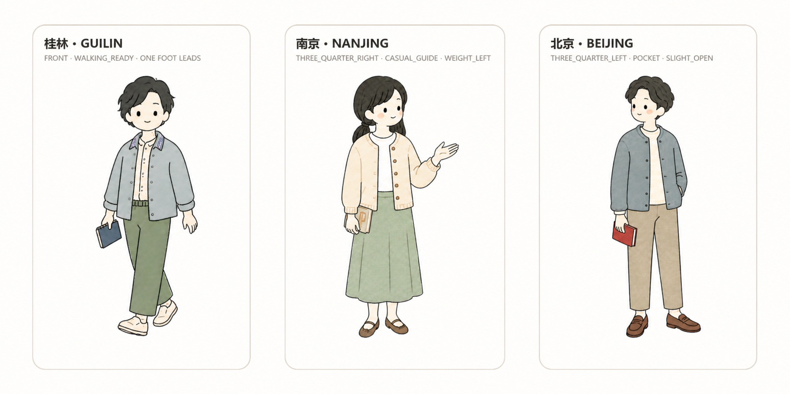
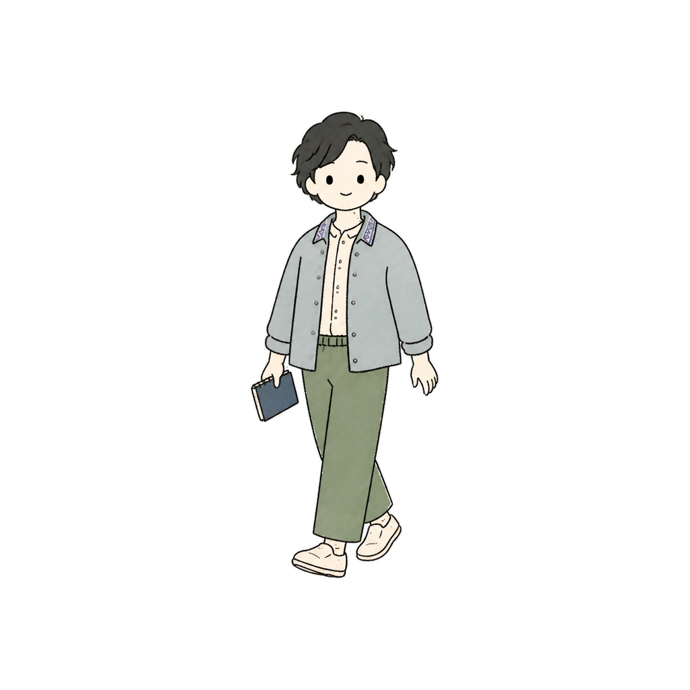
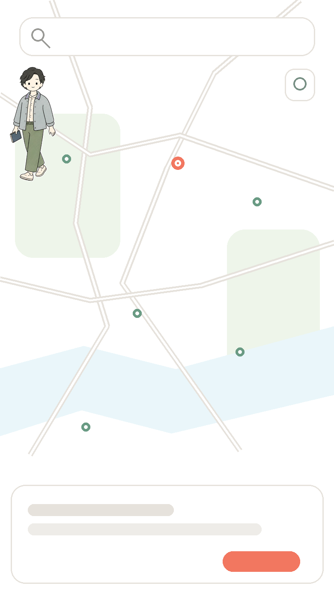
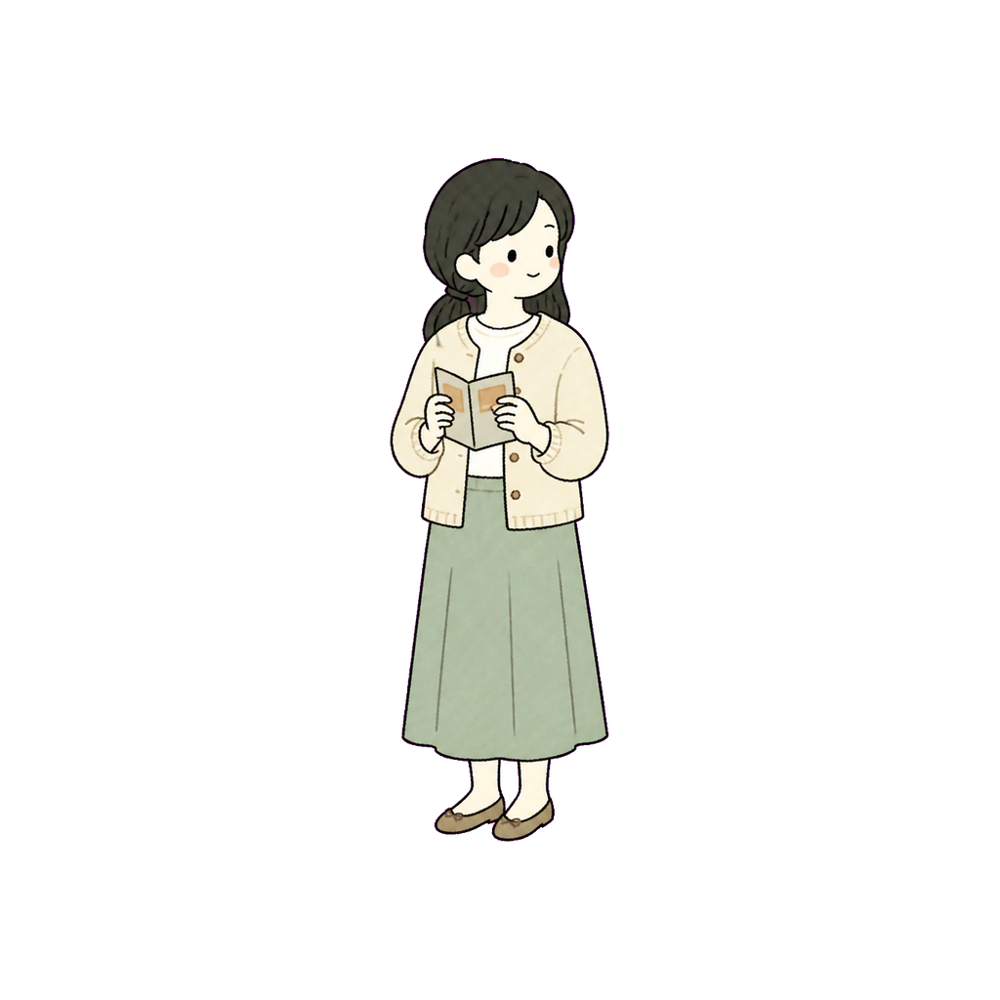
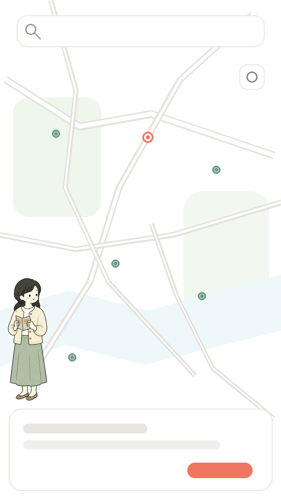
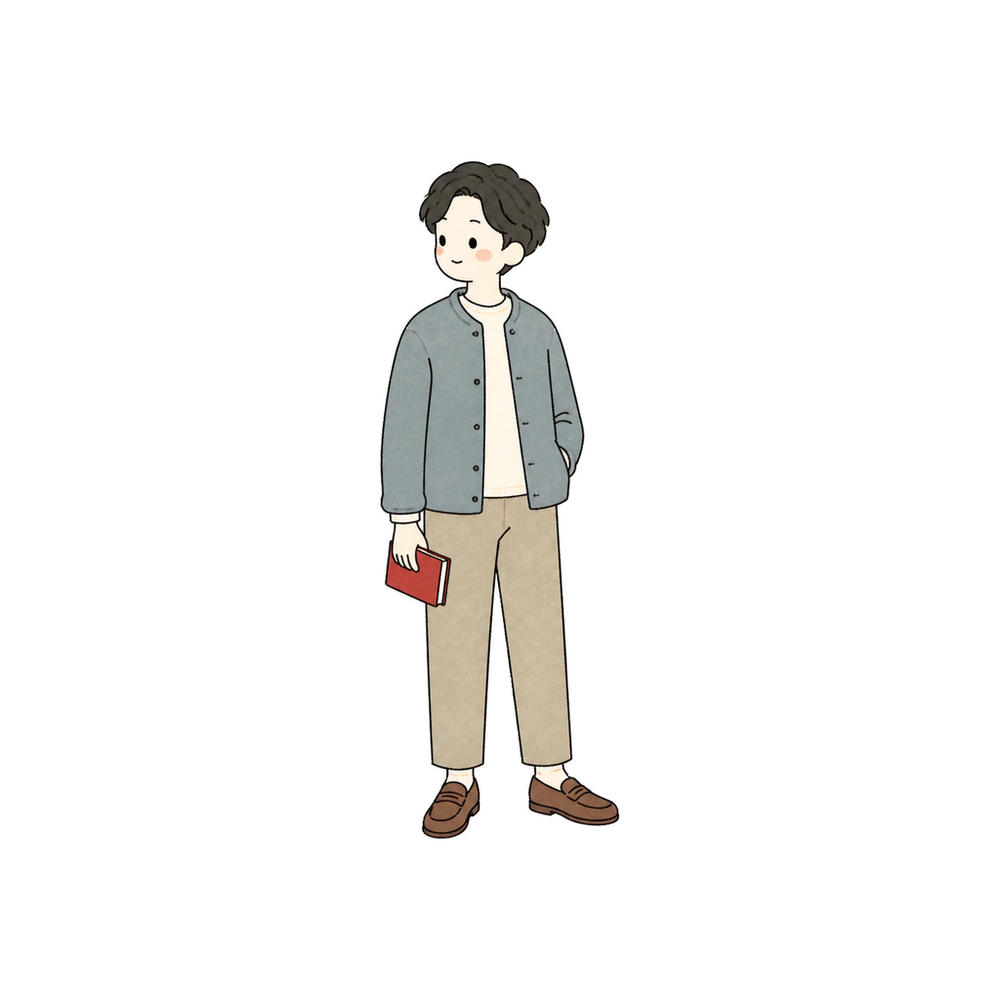
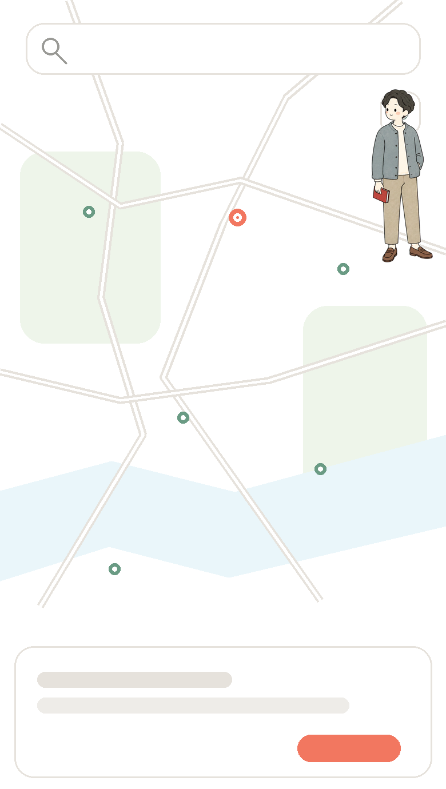

# 🧭 City Guide Character

> **从一座城市的真实气质出发，设计一个能安静待在旅行地图角落里的轻量导览人物。**

城市人物不是地图主角。它提供一点陪伴感和城市记忆，但不能挡住 Marker、路线或用户操作。



当前测试城市：**北京 · 桂林 · 南京**

总览先横向检查三个人的姿态与剪影差异；各城市章节再检查默认约 14% 地图宽度下的可读性。

---

## ✨ 什么是 City Guide Character？

这套系统不会拿一个固定人物，分别换成不同城市的衣服。每个城市都要重新研究，再重新设计一个角色。

```text
城市研究
   ↓
真实文化 / 当代视觉 / 城市气质
   ↓
CITY_CHARACTER_MANIFEST
   ↓
独立人物设计
   ↓
统一视觉体系
```

比例、线条和地图规则保持稳定；气质、发型、服装、配色、动作与道具随城市变化。

> **Same System, Different Character.**
>
> 看起来属于同一套产品，但不是同一个人换装。

## 🧩 三座城市，三种角色

### Guilin

| Character Detail | 14% Map Preview |
|---|---|
|  |  |

松弛的旅行穿搭、自然绿色和观察式动作来自桂林的山水旅行语境，细节保持轻量，不做户外装备广告。

[Character Manifest](examples/guilin/CITY_CHARACTER_MANIFEST.md) · [Transparent PNG](examples/guilin/guilin_character_transparent.png)

### Nanjing

| Character Detail | 14% Map Preview |
|---|---|
|  |  |

米白与灰绿、安静的阅读动作和现代轻文艺穿搭，表达南京的城市散步与博物馆气质。

[Character Manifest](examples/nanjing/CITY_CHARACTER_MANIFEST.md) · [Transparent PNG](examples/nanjing/nanjing_character_transparent.png)

### Beijing

| Character Detail | 14% Map Preview |
|---|---|
|  |  |

沉着的现代博物馆漫步人物，以暖灰蓝、米白和一小块砖红表达中轴观察与古今并置，不使用古装或宫廷符号。

[Character Manifest](examples/beijing/CITY_CHARACTER_MANIFEST.md) · [Transparent PNG](examples/beijing/beijing_character_transparent.png)

## 🗺️ 为什么是 14%？

人物不是主角，地图、Marker、路线和用户操作才是。默认可见宽度约占地图 viewport 的 14%，通常在 12%～16% 之间调整，最大不超过 18%。

```text
发现遮挡
   ↓
尝试另一个安全角
   ↓
按 0.85× 缩小
   ↓
仍然冲突则隐藏
```

人物固定在屏幕角落，不跟随地图 pan / zoom；`pointer-events = none`，不会吃掉拖动或缩放手势。

## ✒️ 角色系统基线

- 所有角色使用同一套手绘钢笔线和柔和色块。
- 人体比例统一在约 4～4.5 头身，五官、手脚和四肢简化方式一致。
- 每个城市先研究气质、当代视觉与真实文化，再填写 `CITY_CHARACTER_MANIFEST`。
- 城市差异不能只靠换发型、换颜色或换手持物；每个 `CITY_CHARACTER_MANIFEST` 必须先锁定 `POSE_SIGNATURE`。
- 三个及以上角色必须执行 `CROSS_CITY_POSE_REVIEW`，检查脸部和身体朝向、手势、站姿、鞋型、剪影与道具交互。
- 地域元素最多使用 1～2 个，而且要有真实来源，避免刻板印象。
- 人物视觉权重始终低于景点贴纸、选中 Marker 和路线。

完整工作流见 [SKILL.md](SKILL.md)。

## 🔍 从城市到角色

```text
STEP 01｜研究城市气质与视觉文化
STEP 02｜整理颜色、穿搭与地域线索
STEP 03｜填写 CITY_CHARACTER_MANIFEST
STEP 04｜锁定 POSE_SIGNATURE
STEP 05｜应用统一比例和 Style Lock
STEP 06｜生成透明人物资产
STEP 07｜制作 14% Map Preview 并检查遮挡
STEP 08｜执行 CROSS_CITY_POSE_REVIEW
```

## ⚙️ 运行方式

Skill 不绑定某一个图片模型。Coding Agent 负责城市研究、Manifest、Prompt 和 QA，可用的图片工具负责人物图像的生成或编辑。

## 🚀 快速安装

```bash
npx skills add fishjoyness/city-guide-character
```

默认安装到当前项目；增加 `--global` 可安装到用户级目录。

### 手动安装

```bash
git clone https://github.com/fishjoyness/city-guide-character.git
```

## 🤖 Supported Agents

| Agent | Project | Global |
|---|---|---|
| OpenAI Codex | `.agents/skills/city-guide-character/` | `~/.agents/skills/city-guide-character/` |
| Claude Code | `.claude/skills/city-guide-character/` | `~/.claude/skills/city-guide-character/` |
| WorkBuddy | `.workbuddy/skills/city-guide-character/` | `~/.workbuddy/skills/city-guide-character/` |

安装后如未立即出现，重新打开 Agent 会话。

## 💬 怎么使用？

```text
请使用 city-guide-character，为杭州设计一个地图角落导览人物。
先研究城市并输出 CITY_CHARACTER_MANIFEST，
再生成透明人物资产和默认 14% 的地图预览。
```

## 🙋 FAQ

**每座城市都必须生成人物吗？**

不必。人物是可选的地图陪伴元素；地图太拥挤或没有合适角色时，可以不显示。

**为什么不能直接用同一个人物换衣服？**

因为城市差异不只来自服装。发型、气质、动作和旅行行为也需要重新设计，否则角色库会变成同一个人的复制品。

**14% 是固定值吗？**

不是。14% 是默认值，常用范围是 12%～16%；碰撞时可以继续缩到 10%，仍不安全就隐藏。

**人物会挡住地图操作吗？**

不会。人物不接收点击，也不能覆盖核心控件；冲突处理优先级高于装饰展示。

**可以只做 Character，不生成地图吗？**

可以，但至少要制作一张 14% Map Preview 做验收。人物大图好看，不代表放进地图后仍然合适。

## ❤️ 最终目标

不是给每座城市套一个模板人物，而是让不同城市拥有不同角色，同时让人一眼看出它们来自同一个旅行产品。

## 目录

```text
city-guide-character/
├─ SKILL.md
├─ prompts/
├─ references/
├─ assets/
├─ evals/
└─ examples/
```

## Related Skill

[city-sticker](https://github.com/fishjoyness/city-sticker) 用于研究真实地标并生成景点贴纸。两个 Skill 可以独立安装，也可以共享同一套旅行产品手绘语言。

## License

本仓库原创内容采用 [MIT License](LICENSE)。
